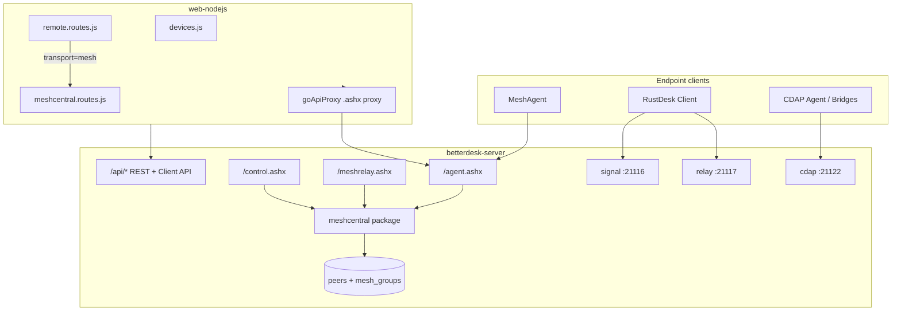

# MeshCentral Compatibility Layer — Architecture & Implementation Plan

> **Version**: 1.0.0  
> **Status**: Draft (planning only — no implementation yet)  
> **Created**: 2026-06-09  
> **Depends on**: [BETTERDESK_v3_OVERVIEW.md](BETTERDESK_v3_OVERVIEW.md), [CDAP_PROTOCOL.md](CDAP_PROTOCOL.md), [REMOTE_CLIENT_UNIFICATION_PLAN.md](../REMOTE_CLIENT_UNIFICATION_PLAN.md)  
> **Upstream reference**: [MeshCentral](https://github.com/Ylianst/MeshCentral) (Apache-2.0), target pin **1.2.x**

---

## Table of Contents

1. [Overview](#overview)
2. [Goals and Non-Goals](#goals-and-non-goals)
3. [Strategic Rationale](#strategic-rationale)
4. [Architecture Decisions](#architecture-decisions)
5. [Protocol Contract](#protocol-contract)
6. [Target Architecture](#target-architecture)
7. [Integration with BetterDesk](#integration-with-betterdesk)
8. [Implementation Phases](#implementation-phases)
9. [Feature Gap Analysis](#feature-gap-analysis)
10. [File-Level Change Map](#file-level-change-map)
11. [Security Requirements](#security-requirements)
12. [Testing Strategy](#testing-strategy)
13. [Deployment & Operations](#deployment--operations)
14. [Risk Assessment](#risk-assessment)
15. [Timeline](#timeline)

---

## Overview

BetterDesk v3 is a multi-protocol device management ecosystem:

| Protocol | Endpoint clients | Transport |
|----------|------------------|-----------|
| **RustDesk** | RustDesk desktop/mobile clients | Signal `:21116`, relay `:21117`, Client API |
| **CDAP** | Native agent, bridges (Modbus, SNMP, REST) | WebSocket `:21122/cdap` |
| **MeshCentral (planned)** | Standard MeshAgent binaries | WebSocket `/agent.ashx`, `/meshrelay.ashx`, `/control.ashx` |

This document defines a **native MeshCentral compatibility layer** built into:

- **`betterdesk-server`** (Go) — protocol gateway, relay, agent registry
- **`web-nodejs`** (panel) — unified inventory, remote viewer, `.msh` generator

The layer is **not a fork** of MeshCentral. It reimplements the **wire protocol contract** that MeshAgent expects, while mapping devices into BetterDesk's existing `peers` table, RBAC, audit, and panel UI.

### Core principle

> **One server, one inventory, three client ecosystems.**  
> RustDesk clients, CDAP agents, and MeshAgents coexist in the same BetterDesk deployment. Operators use one panel; endpoints use the client best suited to their environment.

---

## Goals and Non-Goals

### Goals

- Allow **unmodified MeshAgent** binaries to register and stay connected to BetterDesk (via repointed `.msh` config).
- Enable **remote desktop (KVM)** sessions from the BetterDesk panel (`/remote/:id`) using a third transport (`mesh`).
- Expose MeshAgent devices in the device list with `device_type: mesh_agent` and live `mesh_connected` status.
- **Consolidate ports** — serve MC endpoints on the same HTTPS/API listener as Go REST (no dedicated MC port).
- Provide a **community onboarding path**: deploy MeshAgent today without waiting for the native BetterDesk minimal agent.
- Identify MeshCentral features missing in BetterDesk and plan improvements that benefit all transports.

### Non-Goals (initial releases)

- Forking or embedding the full MeshCentral Node.js server.
- Protocol-level interoperability between MeshAgent KVM and RustDesk relay (no video transcoding bridge).
- Intel AMT / CIRA (`:4433` MPS stack) in MVP.
- Replacing or pausing development of `betterdesk-agent`, `betterdesk-agent-client`, or `betterdesk-mgmt`.
- Full MeshCentral web UI replication.

### Accepted constraint

MeshAgent **cannot** provide remote desktop without **MeshCore** — JavaScript pushed by the server after the binary handshake. BetterDesk ships **BetterCore** (`bettercore.js`, embedded in `betterdesk-server`) and **BetterViewer** (`betterviewer.js`, panel static JS). No upstream MeshCentral JavaScript is vendored in the repository.

---

## Strategic Rationale

### Why add MeshCentral compatibility?

1. **Proven endpoint client** — MeshAgent is mature, cross-platform, and widely deployed. It offers an immediate managed-endpoint story for operators migrating from MeshCentral or evaluating BetterDesk.
2. **Reduces pressure on minimal client roadmap** — While `betterdesk-agent` and MGMT client mature, the community can use MeshAgent as an interim managed endpoint.
3. **Technological combine** — BetterDesk becomes a single control plane for RustDesk + CDAP + MeshCentral fleets.
4. **Feature borrowing** — MeshCentral's RMM patterns (run commands, mesh groups, session recording, port relay) inform BetterDesk improvements across all transports.

### Relationship to native BetterDesk agents

| Path | Role | Status |
|------|------|--------|
| **MeshAgent + MC compat layer** | Community / migration / interim managed endpoint | Planned (this document) |
| **betterdesk-agent (CDAP)** | Native agent with CDAP widgets, DataGuard, supervised access | Active roadmap |
| **betterdesk-mgmt** | Operator standalone client | Active roadmap |
| **RustDesk client** | Standard remote desktop | Production |

Development of native agents **continues in parallel**. MC compat is an optional module (`MESH_ENABLED`), not a replacement strategy.

---

## Architecture Decisions

### AD-1: Native protocol package in Go (not Node.js)

**Decision**: Implement the MC compatibility layer as `betterdesk-server/meshcentral/`, following the CDAP gateway pattern (`cdap/gateway.go`).

**Rationale**: Agent connections and relay piping are performance-sensitive and long-lived. Go already hosts auth, DB, audit, and CDAP. A Node.js implementation would duplicate security-critical relay logic.

### AD-2: Single-port endpoint consolidation

**Decision**: Mount `/agent.ashx`, `/meshrelay.ashx`, and `/control.ashx` on the **same HTTP(S) listener** as the Go API (`-api-port`, default `21114`). In full installs, the web panel (`:5443`) proxies `.ashx` paths to Go so operators expose **one public HTTPS port**.

**Rationale**: Operator preference to minimize open ports. MeshAgent accepts custom `MeshServer` URLs in `.msh` as long as paths and TLS pinning are correct.

```
MeshAgent  →  wss://operator-host:5443/agent.ashx     (panel proxy → Go)
          or  wss://operator-host:21114/agent.ashx    (minimal / direct Go TLS)
```

### AD-3: Unified peer model

**Decision**: MeshAgent nodes map to `db.Peer` rows with `device_type = "mesh_agent"`. MeshCentral `nodeid` (cert-hash based) stored as metadata; BetterDesk `peers.id` remains the panel primary key.

**Rationale**: Reuses existing device list, folders, tags, RBAC, enrollment, and audit. Same pattern as CDAP registration in `cdap/handler.go`.

### AD-4: Device linking

**Decision**: Support `linked_peer_id` between `mesh_agent` and `rustdesk` / `os_agent` peers on the same host (auto-link by hostname + user, manual link in panel).

**Rationale**: Hybrid deployments run MeshAgent alongside RustDesk or CDAP agent on the same machine. Documented in [CDAP_PROTOCOL.md — Device Linking](CDAP_PROTOCOL.md#device-linking).

### AD-5: Third web remote transport

**Decision**: Extend the transport router in `remote.routes.js`:

```
device_type=mesh_agent && mesh_connected  →  transport=mesh
device_type=os_agent || cdap_connected    →  transport=cdap
else                                      →  transport=rd (RustDesk)
```

**Rationale**: Aligns with [REMOTE_CLIENT_UNIFICATION_PLAN.md](../REMOTE_CLIENT_UNIFICATION_PLAN.md) — one URL `/remote/:id`, pluggable transports.

### AD-6: Pinned upstream version

**Decision**: Mesh interoperability uses real MeshAgent binaries against BetterDesk **BetterCore** and **BetterViewer** (AGPL). Interop tests run against MeshAgent 1.2.x agents.

**Rationale**: MC protocol is largely undocumented; behavior is reverse-engineered from source. Pinning limits breakage from upstream changes.

### AD-7: Enabled by default (disable with `MESH_ENABLED=N`)

**Decision**: `MESH_ENABLED=Y` by default on full and minimal installs; operators set `MESH_ENABLED=N` to disable the module.

**Rationale**: MeshAgent/BetterCore is part of the BetterDesk product surface; installers and panel updates inject the env var automatically.

---

## Protocol Contract

MeshCentral uses **WebSocket-centric JSON + binary** protocols, not REST. The compatibility layer must implement these endpoints:

| Endpoint | Handler (upstream) | Purpose | Auth |
|----------|-------------------|---------|------|
| `/agent.ashx` | `meshagent.js` | Persistent agent control channel | Binary cert + RSA nonce |
| `/meshrelay.ashx` | `meshrelay.js` | Session rendezvous (KVM, terminal, files) | Encrypted cookie in URL (`auth` / `rauth`) |
| `/control.ashx` | `meshuser.js` | Browser / automation control channel | Session cookie or `x-meshauth` header |

### Agent binary handshake (before MeshCore)

| Cmd ID | Name | Direction |
|--------|------|-----------|
| 1 | `AuthRequest` | Server → Agent |
| 2 | `AuthVerify` | Bidirectional |
| 3 | `AuthInfo` | Agent → Server |
| 4 | `AuthConfirm` | Server → Agent |
| 5 | `ServerId` | Agent → Server (optional, `.msh` pinning) |

- All cert hashes: **SHA-384**.
- Agent-server cert: **RSA-3072** (separate from public web TLS cert).
- Agent identity (`nodeid`): derived from agent root certificate hash.

### MeshCore delivery (required for remote features)

| Cmd ID | Name | Purpose |
|--------|------|---------|
| 11 | `CoreModuleHash` | Agent reports MeshCore SHA-384 |
| 16 | `CoreOk` | Server approves core |
| 10 / 20 | `CoreModule` / `CompressedCoreModule` | Server pushes `bettercore.js` |

Remote desktop, terminal, and file access execute inside **MeshCore** (Duktape JS runtime inside MeshAgent), not in the C binary alone.

### Agent install file (`.msh`)

```
MeshName=Lab Computers
MeshType=2
MeshID=0xA1B2C3D4...                # 96 hex chars (SHA-384 group id); MeshAgent also accepts 64 hex
ServerID=D99362D5ED8BA...          # SHA-384 of agent-server cert pubkey
MeshServer=wss://betterdesk.example.com/agent.ashx
```

BetterDesk panel generates `.msh` with a stable per-group `MeshID` (96 hex) and correct `ServerID` from `GET /api/mesh/server-id`. MeshAgent rejects shorter placeholders (`bad size`).

### Relay session flow

1. Operator requests desktop → server generates tunnel `id` + encrypted cookies.
2. Server sends JSON to agent: `{ action:'msg', type:'tunnel', value:'*/meshrelay.ashx?p=2&id=...&rauth=...' }`.
3. Browser opens: `wss://host/meshrelay.ashx?browser=1&p=2&id=...&nodeid=...&auth=...`.
4. Relay matches both sides by `id`, sends **`c`** (or **`cr`** if recording) on both WebSockets.
5. Server pipes binary frames between browser and agent (passive relay).

### Relay protocol IDs (`p` parameter)

| `p` | Feature | MVP |
|-----|---------|-----|
| 1 | Terminal (admin shell) | Phase 4 |
| **2** | **Remote desktop (KVM)** | **Phase 2 (MVP)** |
| 5 | Files | Phase 4 |
| 6 / 8 / 9 | PowerShell / user shells | Phase 4 |
| 14 | Web-TCP proxy | Future |
| 100+ | Intel AMT | Out of scope (initial) |

### KVM binary protocol (`p=2`)

Documented MNG_KVM command families (BetterDesk `betterviewer.js`):

- **Agent → Browser**: JPEG tiles, screen size, display list, cursor, input lock, keyboard LED state.
- **Browser → Agent**: key/mouse/touch input, compression/scaling, display selection, Ctrl+Alt+Del.

Initial implementation: **opaque binary forward** through relay (no transcoding). Browser uses the native BetterDesk MNG_KVM viewer.

---

## Target Architecture



### Go package layout: `betterdesk-server/meshcentral/`

| Module | Responsibility |
|--------|----------------|
| `gateway.go` | Lifecycle, connection maps, wiring to `api.Server` |
| `agent_ws.go` | `/agent.ashx` — binary auth, agent state machine |
| `relay_ws.go` | `/meshrelay.ashx` — session matching, `c`/`cr`, binary pipe |
| `control_ws.go` | `/control.ashx` — operator channel, `nodes`, tunnel orchestration |
| `auth.go` | Agent-server RSA cert, SHA-384 pinning, relay cookie crypto |
| `meshcore.go` | Embed and serve BetterCore |
| `kvm.go` | MNG_KVM `p=2` relay / viewer bridge |
| `registry.go` | `nodeid` → `peers.id`, `device_type=mesh_agent` |
| `groups.go` | Mesh groups → BetterDesk folders / device groups |

### Configuration (`config.Config`)

```go
MeshCentralEnabled bool   // env: MESH_ENABLED (Y/N)
MeshCoreVersion    string // pin, e.g. "1.2.0"
MeshAgentCertFile  string // agent-server RSA cert (NOT web TLS cert)
```

---

## Integration with BetterDesk

### Peer registration

On successful agent auth + MeshCore handshake:

1. `db.UpsertPeer` with `device_type: "mesh_agent"`.
2. Store `mesh_node_id` (MC nodeid) in peer metadata / config key.
3. Publish `events.Event{Type: "mesh_agent_connect", ...}` on event bus.
4. Audit: `mesh_agent_register`.

### Peer list enrichment

Mirror `cdap_connected` pattern in `api/server.go`:

```go
meshConnected := s.meshGw != nil && s.meshGw.IsConnected(p.ID)
```

Expose `mesh_connected` and `mesh_node_id` in `GET /api/peers` and `GET /api/peers/{id}`.

### Panel device list

- Icon mapping for `mesh_agent` in `devices.js`.
- Source badge: `rustdesk` | `cdap` | `mesh_agent` | `linked`.
- Connect action routes to `/remote/:id` (auto transport) or MeshCentral-specific deep link during transition.

### Transport router (`remote.routes.js`)

```javascript
// Decision tree (after peer probe)
if (forced === 'mesh' || forced === 'cdap' || forced === 'rd') {
    transport = forced;
} else if (isMeshAgent && meshConnected) {
    transport = 'mesh';
} else if (isOsAgent || cdapConnected) {
    transport = 'cdap';
} else {
    transport = 'rd';
}
```

New browser adapter: `public/js/rdclient/mesh-adapter.js` — same surface as `cdap-adapter.js` (unified events: `videoFrame`, `cursorUpdate`, `ready`, `end`, `error`).

### Mesh groups → BetterDesk folders

MeshCentral device groups ("meshes") map to existing folder / org structures:

- `MeshID` from `.msh` → folder assignment on first connect.
- Admin can move devices between groups in panel (updates MC mesh membership via control channel).

---

## Implementation Phases

### Phase 0 — Specification & interop harness (≈2 weeks)

**Deliverables:**

- This document (finalized after review).
- AGPL assets: **BetterCore** / **BetterViewer** (`bettercore.js`, `betterviewer.js`; see `meshcentral/assets/NOTICE`).
- Docker-based interop test: real MeshAgent → test BetterDesk server.
- `go test` scaffolding for handshake and relay token matching.

**Acceptance criteria:**

- MeshAgent connects, completes binary auth, receives MeshCore.
- Peer appears with `mesh_connected: true`.

### Phase 1 — Agent online & inventory (≈4–6 weeks)

**Go server:**

- Full binary handshake (cmds 1–5).
- Persistent agent-server cert; `GET /api/mesh/server-id`.
- JSON telemetry (`coreinfo`, `network`) → peer info updates.
- Mesh group registry mapped to folders.

**Web panel:**

- Settings → MeshCentral: enable/disable, ServerID display, download `.msh`.
- Device list filter and icon for `mesh_agent`.
- i18n: all 26 locale files.

**Deploy:**

- `MESH_ENABLED` in `envMerge.js`, `betterdesk.sh` / `betterdesk.ps1`.
- No new firewall port.

**Acceptance criteria:**

- Operator downloads `.msh`, installs MeshAgent, device visible in panel as online.

### Phase 2 — Remote desktop (≈6–8 weeks) — **MVP milestone**

**Go server:**

- `/meshrelay.ashx` state machine: `id` matching, `auth`/`rauth` validation, `c` signal, bidirectional pipe.
- Tunnel orchestration via control messages.
- `kvm.go`: opaque MNG_KVM binary relay.

**Web panel:**

- `transport=mesh` in `remote.routes.js`.
- `mesh-adapter.js` + **BetterViewer** native MNG_KVM client.
- `.ashx` proxy on panel HTTPS port.

**Gold-standard acceptance:**

- Operator opens MeshAgent desktop from BetterDesk `/remote/:id`, **or**
- MeshCentral web viewer works against BetterDesk server (interop proof).

### Phase 3 — Operator operations (≈4–6 weeks)

- `/control.ashx`: auth (`x-meshauth` + BetterDesk JWT bridge), `nodes` push, `runcommands`, `authcookie`.
- Panel actions: run command, terminal entry point, file browser entry point (RBAC-gated).
- meshctrl subset: `listdevices`, `runcommand`, `devicepower` (WoL bridges to existing `POST /api/peers/{id}/wol`).
- Audit events: `mesh_session_start`, `mesh_runcommand`, `mesh_session_end`.

### Phase 4+ — Extended features & BetterDesk improvements (ongoing)

See [Feature Gap Analysis](#feature-gap-analysis). Includes terminal (`p=1`), files (`p=5`), unified session recording, port-forward UI, remote exec API, desktop multiplexing.

### Phase 5 — Client ecosystem strategy (documentation + panel UX)

- Document community path: MeshAgent → BetterDesk `.msh`.
- Continue [AGENT_CLIENT_ROADMAP_2026-05-27.md](../AGENT_CLIENT_ROADMAP_2026-05-27.md) without pause.
- Future MGMT client: fourth transport `mesh` in device list.
- `linked_peer_id` UX for hybrid hosts.

---

## Feature Gap Analysis

MeshCentral features that BetterDesk lacks or implements differently — opportunities to improve the whole product:

| MeshCentral feature | BetterDesk today | Status |
|---------------------|------------------|--------|
| Remote terminal (`p=1`) | Mesh relay + panel modal | **Done** |
| Remote files (`p=5`) | Mesh relay + panel / remote files panel | **Done** |
| Run commands (agent channel) | `POST /api/peers/{id}/exec` mesh + CDAP | **Done** |
| Session recording (`.mcrec`) | Server capture + Settings list; BD raw format | **Partial** (not MC-native player) |
| Desktop multiplexing | KVM hub relay (`relay_hub.go`) | **Done** |
| TCP/UDP port map (MeshRouter) | REST + panel TCP/UDP modals | **Partial** (basic UX) |
| Device sharing / guest links | `mesh_share` tokens + view-only remote | **Done** |
| MeshCore hot-push | Not implemented | Backlog |
| Intel AMT / CIRA (`:4433`) | Not implemented | Backlog |
| In-browser RDP/SSH/VNC | Not implemented | Backlog |
| MeshScanner (LAN discovery) | Not implemented | Backlog |
| Plugin hooks (server + agent) | Panel widgets | **Partial** |
| Granular mesh rights (bitfield) | `mesh.terminal` / `mesh.files` / `mesh.power` permissions | **Partial** |
| meshctrl automation | REST — see [MESH_REST_AUTOMATION.md](../features/MESH_REST_AUTOMATION.md) | **Done** (BD-native) |

### What BetterDesk already has (no MC borrow needed)

- Wake-on-LAN (`POST /api/peers/{id}/wol`) — mesh wake falls back to WoL via `linked_peer_id` / telemetry MAC.
- JWT + TOTP 2FA — map to MC `x-meshauth` with token third field.
- API keys — automation alternative to meshctrl login keys.
- Chat relay — comparable to MC Messenger (different protocol).
- CDAP widgets / automation — beyond MC's RMM scope.

---

## File-Level Change Map

### New files (Go)

| Path | Purpose |
|------|---------|
| `betterdesk-server/meshcentral/gateway.go` | Main gateway |
| `betterdesk-server/meshcentral/agent_ws.go` | Agent WebSocket handler |
| `betterdesk-server/meshcentral/relay_ws.go` | Relay WebSocket handler |
| `betterdesk-server/meshcentral/control_ws.go` | Control WebSocket handler |
| `betterdesk-server/meshcentral/auth.go` | Certificates, cookies |
| `betterdesk-server/meshcentral/meshcore.go` | Asset serving |
| `betterdesk-server/meshcentral/kvm.go` | KVM relay |
| `betterdesk-server/meshcentral/registry.go` | Peer mapping |
| `betterdesk-server/meshcentral/groups.go` | Mesh groups |
| `betterdesk-server/meshcentral/assets/` | BetterCore + BetterViewer JS |
| `betterdesk-server/meshcentral/*_test.go` | Unit + interop tests |
| `betterdesk-server/api/mesh_handlers.go` | REST helpers (`/api/mesh/*`) |

### Modified files (Go)

| Path | Change |
|------|--------|
| `betterdesk-server/main.go` | Start mesh gateway, `SetMeshGateway` |
| `betterdesk-server/config/config.go` | `MeshCentralEnabled`, cert paths, version pin |
| `betterdesk-server/api/server.go` | Register `.ashx` routes, `mesh_connected` enrichment |
| `betterdesk-server/db/sqlite.go` | Optional `mesh_node_id`, `mesh_group_id` columns |
| `betterdesk-server/db/postgres.go` | Same migrations |
| `betterdesk-server/audit/logger.go` | MC audit action types |

### New files (panel)

| Path | Purpose |
|------|---------|
| `web-nodejs/routes/meshcentral.routes.js` | Settings, `.msh` download, API proxy |
| `web-nodejs/public/js/rdclient/mesh-adapter.js` | Third transport adapter |
| `web-nodejs/views/partials/mesh-settings.ejs` | Settings UI section |

### Modified files (panel)

| Path | Change |
|------|--------|
| `web-nodejs/routes/remote.routes.js` | `transport=mesh` decision |
| `web-nodejs/public/js/devices.js` | Icons, filters, connect actions |
| `web-nodejs/public/js/remote.js` | Register mesh transport |
| `web-nodejs/lib/goApiProxy.js` | Proxy `.ashx` to Go |
| `web-nodejs/server.js` | Mount routes |
| `web-nodejs/lib/envMerge.js` | `MESH_ENABLED` key |
| `web-nodejs/lang/*.json` | 26 locales |

### Ops / release

| Path | Change |
|------|--------|
| `betterdesk.sh` / `betterdesk.ps1` | Env defaults, no extra port |
| `CHANGELOG.md` | User-visible feature entry |
| GitHub issue | Label `Next Updates`, verify steps |

---

## Security Requirements

Must be satisfied before production enablement:

| Requirement | Implementation notes |
|-------------|---------------------|
| Separate agent-server cert (RSA-3072) | Loss requires full agent re-enrollment (same as MeshCentral) |
| SHA-384 pinning (`ServerID`) | Validated on every agent connect |
| Rate limit on `/agent.ashx` WS upgrade | Follow `cdap/gateway.go` IP limiter pattern |
| Relay cookie encryption + replay resistance | Unit tests modeled on `bd_mgmt_handlers_test.go` |
| RBAC mapping | MC rights bitfield → BetterDesk roles (`viewer` / `operator` / `admin`) |
| Audit without KVM payload logging | Log session metadata only, never raw frames |
| Optional module default off | `MESH_ENABLED=N` on minimal installs |
| TLS | Reuse Go API TLS; panel proxy only over HTTPS |

---

## Testing Strategy

| Test | Expected result |
|------|-----------------|
| MeshAgent + generated `.msh` → BetterDesk | Device online, `device_type=mesh_agent` |
| `GET /api/peers/{id}` | `mesh_connected: true` when agent connected |
| Panel `/remote/:id` on mesh device | KVM session established |
| Same host: MeshAgent + RustDesk peer | `linked_peer_id` links records |
| Panel update (Settings → Updates) | Module deploys without manual steps |
| `go test ./meshcentral/...` | Handshake, relay match, cookie auth pass |
| Security regression | Rate limit blocks WS upgrade flood |
| Interop | MeshCentral 1.2.x MeshAgent on Linux + Windows |

CI should include at least one **real MeshAgent binary** test job (not mocks only).

---

## Deployment & Operations

### Environment variables

| Variable | Default | Description |
|----------|---------|-------------|
| `MESH_ENABLED` | `N` (minimal), `Y` (full, TBD) | Enable MC compat layer |
| `MESH_CORE_VERSION` | `1.2.0` | Pinned upstream assets |
| `MESH_AGENT_CERT_FILE` | auto-generated path | Agent-server RSA cert (`.msh` `ServerID`) |
| `MESH_WEB_CERT_FILE` | (empty) | Public TLS cert agents see on `MeshServer` (proxy LE); overrides `TLS_CERT` for web-hash only |

### Port exposure

No new ports. Ensure reverse proxy routes:

```
/agent.ashx      → Go API listener
/meshrelay.ashx  → Go API listener
/control.ashx    → Go API listener
```

### Agent onboarding flow

1. Admin enables MC compat in panel Settings.
2. Admin creates device group (mesh) or uses default.
3. Admin downloads `.msh` or invite link.
4. Install MeshAgent on endpoint with generated config.
5. Device appears in BetterDesk device list.
6. Operator connects via Web Remote.

### Update path

Ships via built-in panel updater (`updateService.js`) and `betterdesk.sh` / `betterdesk.ps1` — same as other `betterdesk-server/` and `web-nodejs/` changes per [betterdesk-update-flow.md](../important/betterdesk-update-flow.md).

---

## Risk Assessment

| Risk | Likelihood | Impact | Mitigation |
|------|------------|--------|------------|
| Undocumented protocol changes in upstream MC | Medium | High | Pin version 1.2.x; interop CI with real agent |
| Large maintenance burden | Medium | Medium | Optional module; clear ownership; phased scope |
| MeshCore JS dependency | High | High | Verbatim upstream initially; minimal fork |
| Three session transports increase panel complexity | Medium | Medium | Unified `/remote/:id` router (already planned) |
| Agent-server cert loss | Low | Critical | Backup cert; documented re-enrollment procedure |
| Security flaw in relay auth | Low | Critical | Security review before GA; penetration test on relay |

---

## Timeline

| Phase | Duration | Deliverable |
|-------|----------|-------------|
| 0 | ≈2 weeks | Spec, assets, interop harness |
| 1 | ≈4–6 weeks | Agent online, panel inventory, `.msh` generator |
| 2 | ≈6–8 weeks | Remote desktop end-to-end (**MVP**) |
| 3 | ≈4–6 weeks | `control.ashx`, runcommands, audit |
| 4+ | Ongoing | Terminal, files, recording, port map, AMT |

**MVP (Phases 0–2): ≈3–4 months** — MeshAgent as a working managed endpoint on BetterDesk without building a native minimal client first.

---

## References

- [MeshCentral GitHub](https://github.com/Ylianst/MeshCentral)
- [MeshCentral Design & Architecture](https://docs.meshcentral.com/design/)
- [MeshCtrl documentation](https://docs.meshcentral.com/meshctrl/)
- [BetterDesk v3 Overview](BETTERDESK_v3_OVERVIEW.md)
- [CDAP Protocol](CDAP_PROTOCOL.md)
- [Remote Client Unification Plan](../REMOTE_CLIENT_UNIFICATION_PLAN.md)
- [Agent Client Roadmap](../AGENT_CLIENT_ROADMAP_2026-05-27.md)

---

## Document history

| Version | Date | Change |
|---------|------|--------|
| 1.0.0 | 2026-06-09 | Initial planning document (no implementation) |
